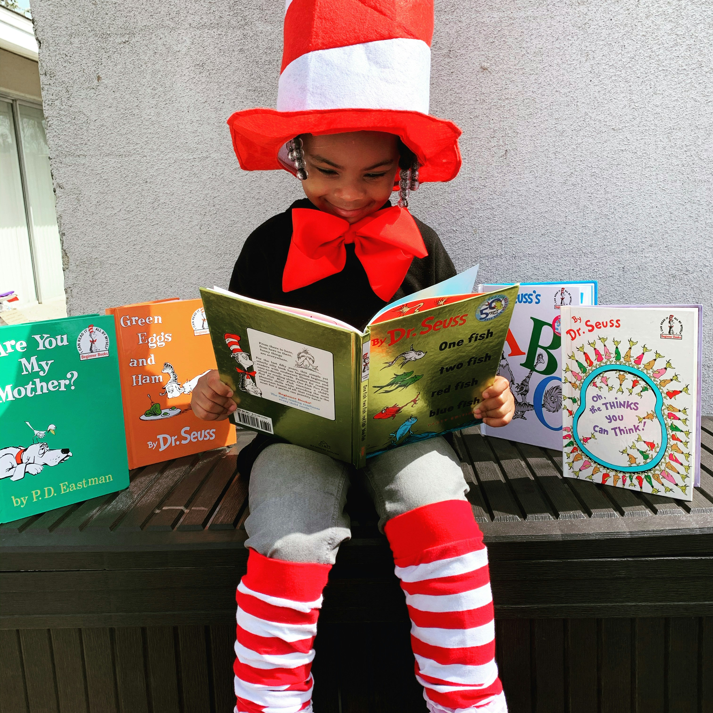

## Por que as Emoções Infantis Merecem Nossa Atenção?

O desenvolvimento emocional das crianças é tão crucial quanto o físico e cognitivo. Desde os primeiros anos de vida, as crianças experimentam uma ampla gama de emoções, mas ainda não possuem as ferramentas necessárias para compreendê-las e lidar com elas de forma adequada.

### O Que São as Emoções na Infância?

As emoções são reações naturais a eventos internos e externos. Para as crianças, cada nova experiência pode gerar sentimentos intensos: desde a alegria de descobrir algo novo até a frustração de não conseguir realizar uma tarefa.

**Principais emoções na infância:**
- Alegria e entusiasmo
- Medo e ansiedade  
- Raiva e frustração
- Tristeza e melancolia
- Surpresa e curiosidade

### Por que Trabalhar as Emoções é Fundamental?

#### 1. **Desenvolvimento da Inteligência Emocional**
Crianças que aprendem a identificar e nomear suas emoções desenvolvem maior capacidade de:
- Autorregulação emocional
- Empatia com os outros
- Resolução de conflitos
- Tomada de decisões conscientes

#### 2. **Prevenção de Problemas Futuros**
O trabalho emocional na infância ajuda a prevenir:
- Transtornos de ansiedade e depressão
- Comportamentos agressivos
- Dificuldades de relacionamento
- Baixa autoestima

#### 3. **Melhoria no Desempenho Escolar**
Estudos mostram que crianças emocionalmente equilibradas apresentam:
- Maior concentração nas atividades
- Melhor relacionamento com colegas e professores
- Redução do estresse escolar
- Maior motivação para aprender

### Como Trabalhar as Emoções das Crianças?

#### **Para Pais e Cuidadores:**

1. **Seja um Modelo**
   - Demonstre como lidar com suas próprias emoções
   - Fale sobre seus sentimentos de forma adequada
   - Mostre estratégias de regulação emocional

2. **Valide os Sentimentos**
   - Aceite todas as emoções como válidas
   - Evite frases como "não fique triste" ou "isso não é nada"
   - Use frases como "entendo que você está bravo"

3. **Ensine Vocabulário Emocional**
   - Ajude a criança a nomear o que sente
   - Use livros e histórias para discutir emoções
   - Crie um "termômetro emocional" visual

#### **Para Educadores:**

1. **Crie um Ambiente Acolhedor**
   - Estabeleça rotinas que transmitam segurança
   - Tenha momentos específicos para falar sobre sentimentos
   - Use atividades lúdicas para explorar emoções

2. **Implemente Estratégias Pedagógicas**
   - Círculos de conversa sobre emoções
   - Jogos que envolvam identificação emocional
   - Arte-terapia e expressão criativa

### Atividades Práticas para Desenvolver a Inteligência Emocional

#### **Atividades para Casa:**
- **Diário das Emoções**: Desenhar ou escrever sobre os sentimentos do dia
- **Teatro de Fantoches**: Representar diferentes emoções
- **Música e Movimento**: Expressar sentimentos através da dança
- **Respiração Consciente**: Técnicas simples de relaxamento

#### **Recursos Úteis:**

- Livros infantis sobre emoções
- Aplicativos educativos sobre sentimentos
- Jogos de tabuleiro focados em inteligência emocional
- Vídeos educativos apropriados para a idade

### Sinais de que a Criança Precisa de Mais Apoio Emocional

Fique atento a:
- Mudanças bruscas de comportamento
- Dificuldade para dormir ou pesadelos frequentes
- Regressão em habilidades já adquiridas
- Isolamento social excessivo
- Explosões emocionais muito intensas ou frequentes

### Quando Buscar Ajuda Profissional?

Considere procurar um psicólogo infantil quando:
- Os comportamentos persistem por mais de 6 meses
- Há impacto significativo na vida escolar ou familiar
- A criança expressa pensamentos de autolesão
- Os pais se sentem incapazes de lidar com a situação

## Conclusão

Trabalhar as emoções das crianças é um investimento no futuro delas. Quando oferecemos às crianças as ferramentas necessárias para compreender e gerenciar seus sentimentos, estamos contribuindo para que se tornem adultos mais equilibrados, resilientes e capazes de construir relacionamentos saudáveis.

Lembre-se: cada criança é única, e o processo de desenvolvimento emocional acontece em ritmos diferentes. O importante é manter a paciência, o amor e a disponibilidade para apoiá-las nessa jornada de descobertas emocionais.

---

*O desenvolvimento emocional é uma jornada contínua que se estende por toda a vida. Começar cedo é dar às nossas crianças a base sólida de que precisam para enfrentar os desafios futuros com confiança e equilíbrio.*